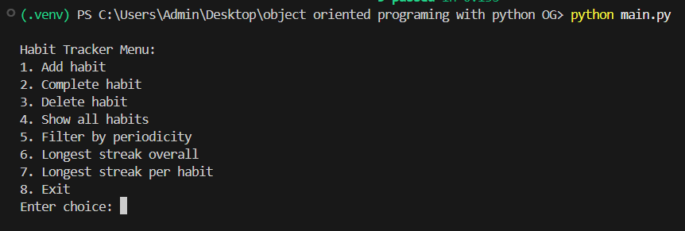
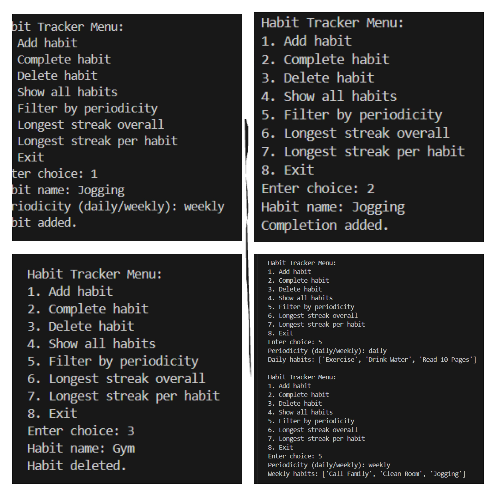
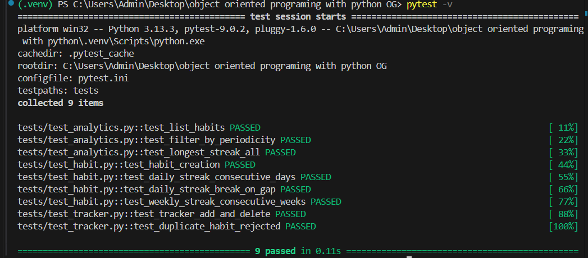
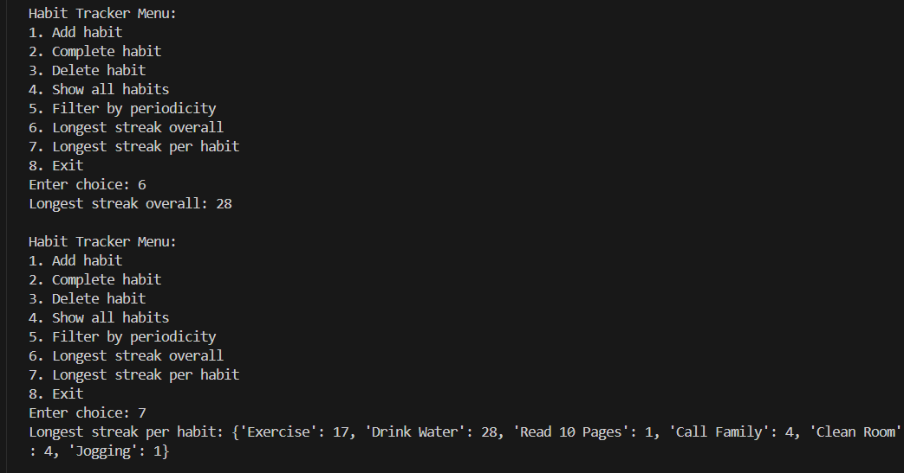

# Habit Tracking Application

A Python Habit Tracking Application, Modular Created for the course DLBDSOOFPP01, Object-Oriented and Functional Programming with Python at IU International University of Applied Sciences. 
This Application (back-end) provides functionalities for users to define habits, record completions, measure progress, calculate streaks, and save habit data between two sessions via JSON storage. The project exhibits object-oriented programming, functional programming concepts, modular software design, automated testing, and analytics implementation.


**Author**

**Name**: Rusingiza Nshuti Braille

**Matriculation Number**: 4243333

**University**: IU International University of Applied Sciences

**Course**: DLBDSOOFPP01 – Object-Oriented and Functional Programming with Python

## Project Description

The Habit Tracking Application is a backend-focused command-line application designed to help users build and monitor habits over time. Users can create habits with different periodicities, mark habits as completed, analyse streaks, and persist their progress between sessions.
The project was developed using Python while applying software engineering principles such as:
-	Object-Oriented Programming (OOP)
-	Functional Programming
-	Modular Software Architecture
-	Persistent Data Storage
-	Automated Unit Testing
-	Analytics and Streak Calculation

The application supports both daily and weekly habits and correctly calculates streaks according to each habit’s periodicity.

## Features

### Habit Management
-	Create new habits
-	Delete habits
-	Mark habits as completed
-	View all tracked habits

### Analytics Features
-	View all currently tracked habits
-	Filter habits by periodicity
-	Calculate the longest streak overall
-	Calculate the longest streak for a specific habit

### Data Persistence
-	Habit data is stored in JSON format
-	Data persists between application sessions 

### Testing
-	Automated unit tests using pytest
-	Tests for habit management and analytics
-	Tests for daily and weekly streak calculations

## Technologies Used

Python 3:	Main programming language
pytest:	Automated unit testing
JSON:	Persistent data storage
Git & GitHub:	Version control and project hosting

## Object-Oriented Programming Concepts Used:
The project applies several important object-oriented programming concepts:

### Encapsulation
Related data and functionality are grouped together inside classes.
Example:
class Habit:
    def __init__(self, name, periodicity):
        self.name = name
        self.periodicity = periodicity

### Composition
The HabitTracker class uses storage and analytics modules together.
### Modular Design
The application is divided into logically separated modules to improve readability and maintainability.

## Project Structure

```text
Habit-Tracking-App-Back-end/
├── data/
│   └── habits.json
├── habit_tracker/
│   ├── __init__.py
│   ├── analytics.py
│   ├── cli.py
│   ├── exceptions.py
│   ├── fixtures.py
│   ├── habit.py
│   ├── storage.py
│   └── tracker.py
├── tests/
│   ├── test_analytics.py
│   ├── test_habit.py
│   └── test_tracker.py
├── screenshots/
│   ├── cli_menu.png
│   ├── analytics_results.png
│   ├── unit_tests.png
│   └── streak_examples.png
├── .gitignore
├── main.py
├── README.md
├── requirements.txt
└── pytest.ini


## Analytics Module

The analytics module was implemented using **functional programming** concepts (pure functions with no side effects) and contains the following functions:

| Function                    | Description                                      |
|-----------------------------|--------------------------------------------------|
| `list_habits()`             | Returns all tracked habits                       |
| `filter_by_periodicity()`   | Filters habits by periodicity (daily/weekly)     |
| `longest_streak_all()`      | Returns the longest streak overall               |
| `longest_streak_per_habit()`| Returns the longest streak for a specific habit  |

The analytics functions are completely separated from the user interface and storage logic to improve modularity and testability.


## Streak Calculation Logic

One of the most important parts of the project is streak calculation.

- **Daily Habits**: Calculated using consecutive calendar days  
- **Weekly Habits**: Calculated using consecutive ISO calendar weeks  

This ensures that weekly habits are not incorrectly evaluated as daily habits.


## Predefined Habit Data

The project includes **4+ weeks** of predefined fixture data in `fixtures.py` and `data/habits.json`.  
This data is used for testing streak calculations, analytics functions, and demonstrating the application.


## Installation

1. **Clone the repository**
   ```bash
   git clone https://github.com/BrailleNshuti/Habit-Tracking-App-Back-end.git
   cd Habit-Tracking-App-Back-end
   ```

2. **Create a virtual environment**
   ```bash
   python -m venv .venv
   # Windows
   .venv\Scripts\activate
   # macOS / Linux
   source .venv/bin/activate
   ```

3. **Install dependencies**
   ```bash
   pip install -r requirements.txt
   ```


## How to Run the Application

```bash
python main.py
```


## How to Run Unit Tests

```bash
pytest
```

Expected result: **9 Tests passed**


## Screenshots

**Main CLI Menu**  


**Analytics Results**  


**Unit Tests Passing**  


**Streak Calculation Example**  



## Code Quality & Documentation

- Follows Python naming conventions (PascalCase for classes, snake_case for functions/variables)
- Includes docstrings and inline comments
- Uses `.gitignore` to keep the repository clean
- Formatted with Black and linted with Ruff


## Challenges & Improvements

The biggest challenge was implementing correct streak calculations for both daily and weekly habits. After Phase 2 feedback, the project was significantly improved in modularity, testing quality, and documentation.


## Conclusion

The Habit Tracking Application successfully fulfils all portfolio requirements for the course **DLBDSOOFPP01 – Object-Oriented and Functional Programming with Python**.

It demonstrates strong understanding of:
- Object-Oriented Programming
- Functional Programming
- Modular software design
- Persistent JSON storage
- Automated unit testing

**GitHub Repository:** [https://github.com/BrailleNshuti/Habit-Tracking-App-Back-end](https://github.com/BrailleNshuti/Habit-Tracking-App-Back-end)
